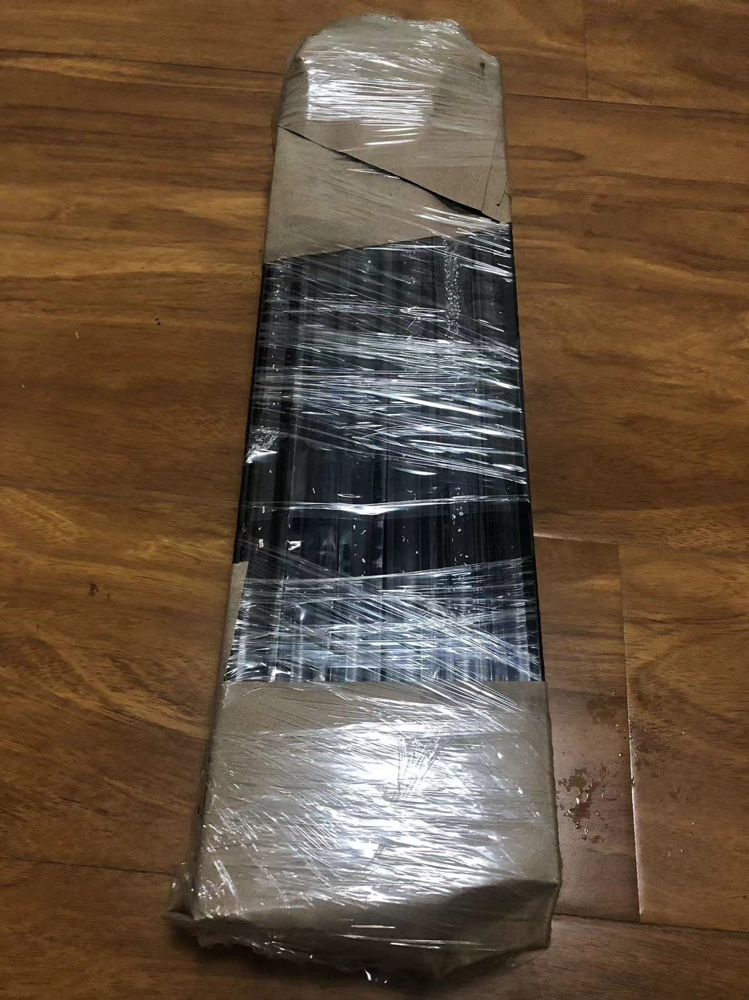
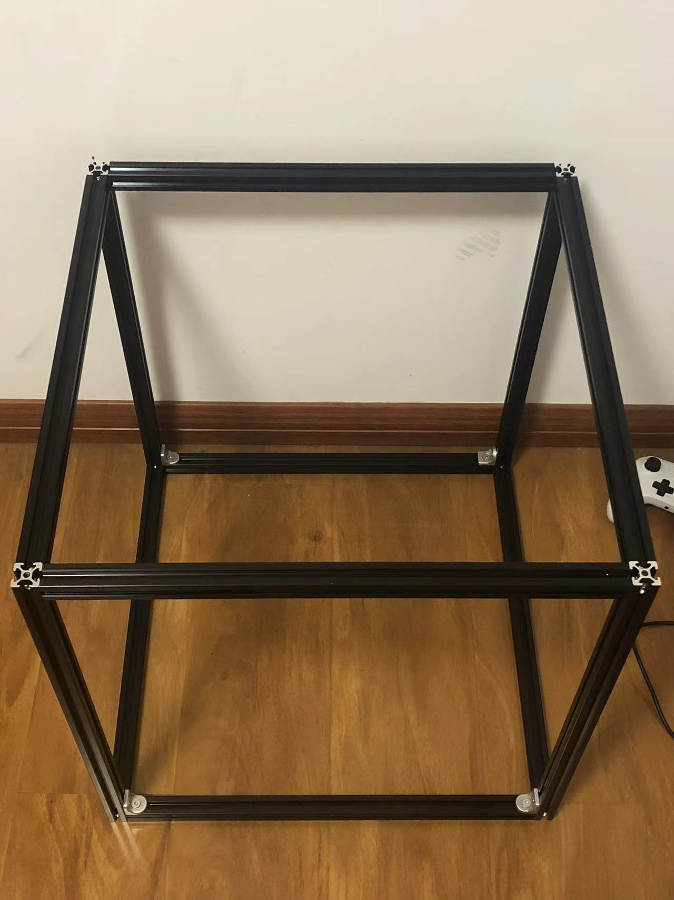
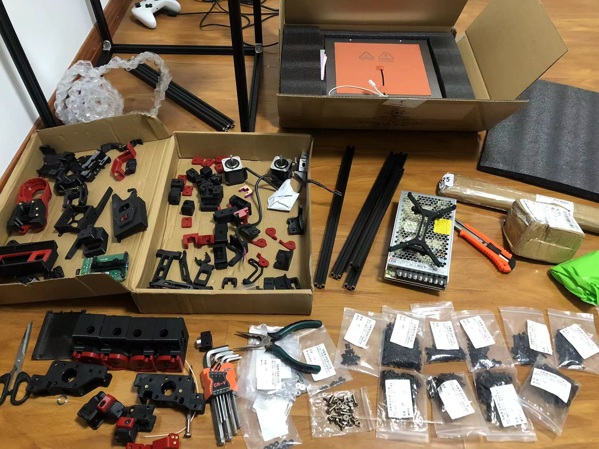
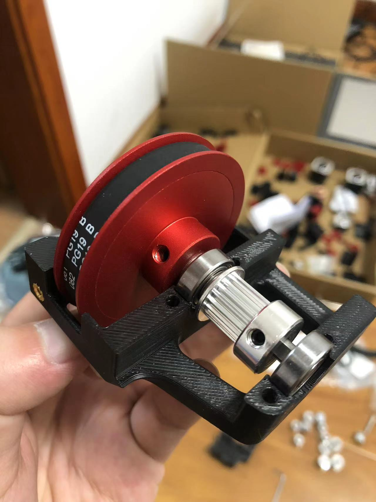
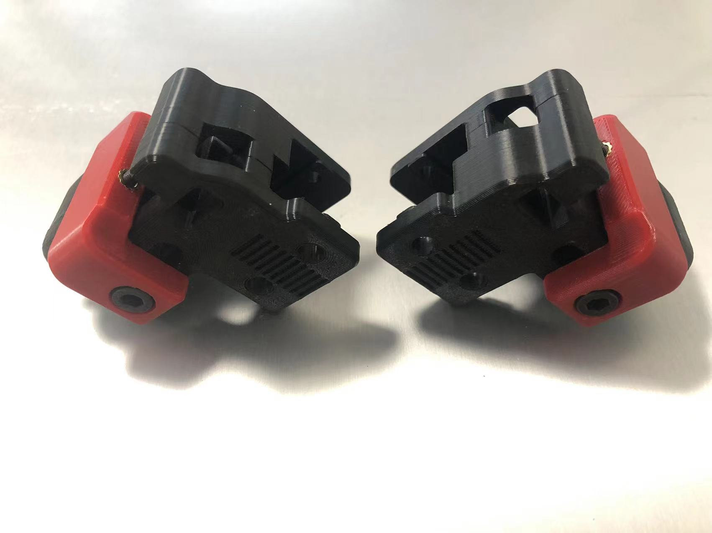
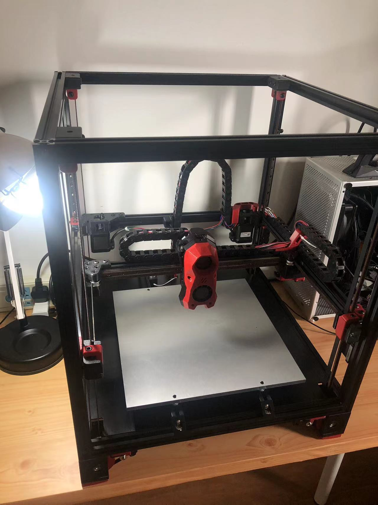
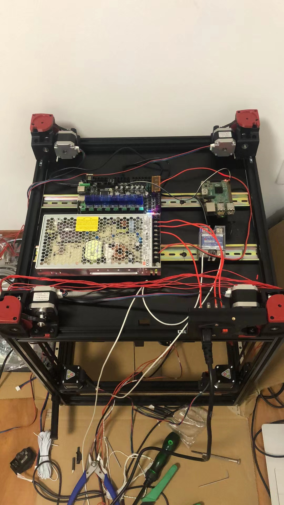
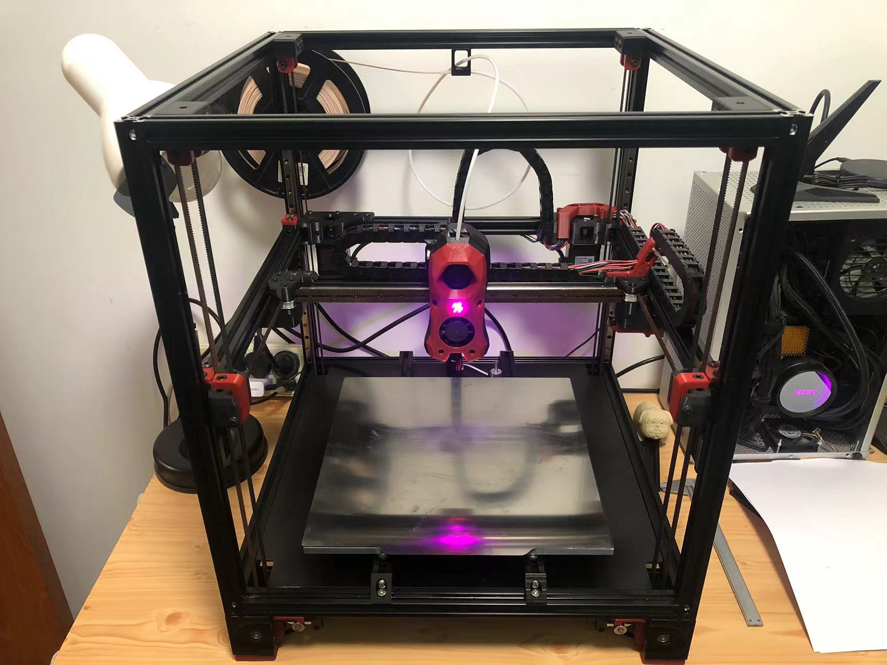

# building-voron
From Parts to Printer

北京时间 2023-5-9 12:33:43，我决定组装一台 voron 打印机。

在此记录组装过程。

---

北京时间 2023-7-5，我的 voron2.4 完成封箱。事实证明我做不到完整记录整个过程 :(

此间陆续打印了一些东西，但还没有测试出机器的各项极限以及合适的切片参数。后续计划学习 PrusaSlicer，探索我的机器的最佳切片配置。

---

过程中拍了一些照片

