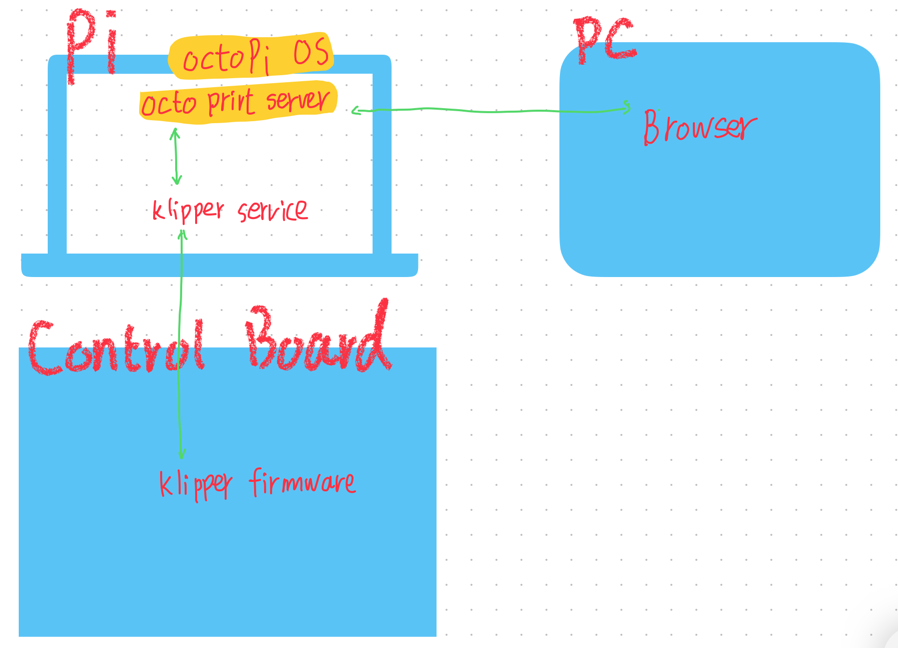

# Klipper

## 目前我的认知

Klipper 文档中默认推荐使用 [OctoPi 系统镜像](https://www.klipper3d.org/Installation.html#prepping-an-os-image)，其中预装了 OctoPrint。
这是一个通用的 3d 打印管理系统。
 
但是OctoPi OS 和 OctoPrint 并不是唯一选择。

Voron 文档中还给出另外 [2 个管理系统](https://docs.vorondesign.com/build/software/) ：
- Mainsail
- Fluidd

## 关于固件

目前手里有一个古董 MKS base v1.3 里面刷了 Marlin 固件。 试了一下是可以用 octoprint 控制打印的 (就和以前用电脑软件联机打印一样，只不过现在连的是树莓派）。

尝试了刷入 klipper 固件，固件刷入成功，但是全网都没找到合适的 配置文件。有时间再研究，睡觉。

