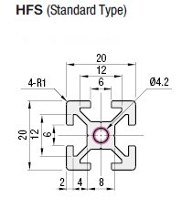
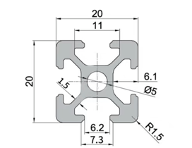
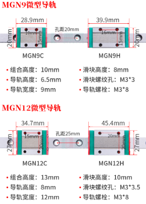

# 采购方案

[官网配置生成的 BOM](../assets/generated_boms.xlsx)

[官方采购指南](https://vorondesign.com/sourcing_guide?model=V2.4)
```angular2html
Build Volume
    X: 300 mm
    Y: 300 mm
    Z: 280 mm

Frame Dimensions
    W: 460 mm
    D: 460 mm
    H: 480 mm
```

## 1. 铝型材 + 配套紧固件

### 欧标 2020

- 290mm x1 
- 380mm x1
- 400mm x2
- 420mm x10 (双端攻丝)
- 480mm x4  (双端过孔)

### OpenBuilds Billet Angle Corner Connector (2020)

没找到啊 实在不行就用打印件吧

### 紧固件

螺栓
- M6*16 x20 半圆头内六角
- M5*10 x8  半圆头内六角
- M3*8  x38 杯头内六角
- M3*16 x4  杯头内六角

螺母
- M3    x38 欧标T型螺母块
- M5    x8  欧标T型螺母块

垫片
- M5 x4

> 店铺链接
> 
>[欧标2020](https://item.taobao.com/item.htm?spm=a230r.1.14.1.54cd7b1fLV2n9D&id=610844048816&ns=1&abbucket=16#detail)
> 
> [半圆头螺栓](https://detail.tmall.com/item.htm?abbucket=11&id=524175136089&rn=86078eb0fe561875d23f50002b95975b&scene=taobao_shop&skuId=3591128700008&spm=a1z10.4-b.w5003-22266262308.3.52277674pfQqqe)
>
> [欧标T型螺母块](https://detail.tmall.com/item.htm?abbucket=11&id=524123794232&rn=86078eb0fe561875d23f50002b95975b&scene=taobao_shop&spm=a1z10.4-b.w5003-22266262309.1.52277674pfQqqe)
>
> [垫片](https://detail.tmall.com/item.htm?abbucket=12&id=534108613687&rn=f1c4ea623c34e21f2382c05a546a79d8&scene=taobao_shop&spm=a1z10.4-b.w5003-22787384487.2.52277674pfQqqe)


-------------

## 2. 线轨

- MGN9H * 350mm x6
- MGN12H * 350mm x1

> 淘宝 [MGN9H/MGN12H](https://item.taobao.com/item.htm?spm=a1z0d.7625083.1998302264.6.5c5f4e694GzTbZ&id=538777574566)


## 3. 电气安装卡轨
DIN 3 Rails (35mm W)

- 415mm x2

> 淘宝关键字：DIN 35 导轨
>
> 1. https://item.taobao.com/item.htm?spm=a230r.1.14.1.5c3c6aed4H9lSK&id=602726886719&ns=1&abbucket=16#detail
> 2. https://item.taobao.com/item.htm?spm=a230r.1.14.31.683546d05425AE&id=687291320766&ns=1&abbucket=16#detail


# # Notes

## Blind joints 




## Misumi HFSB5-2020-290


## 欧标2020
注意和 Misumi 的区别



## 线轨


## DIN 3 Rails (35mm W)

装在热床下面，用于在上面安装控制板电源等。


## 结构件

如图，就用 ABS 结构件吧。

