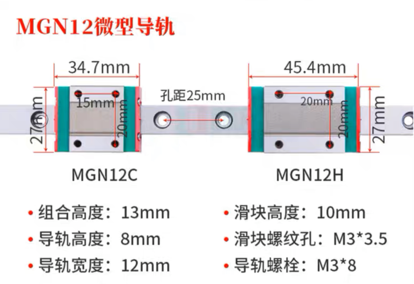

# 采购方案

[官网配置生成的 BOM](../assets/generated_boms.xlsx)

[官方采购指南](https://vorondesign.com/sourcing_guide?model=V2.4)
```angular2html
Build Volume
    X: 300 mm
    Y: 300 mm
    Z: 280 mm

Frame Dimensions
    W: 460 mm
    D: 460 mm
    H: 480 mm
```

## 结构件

如图，就用 ABS 结构件吧。


## 框架

### - OpenBuilds Billet Angle Corner Connector (2020)


用于连接热床架和框体

替换为

### - DIN 3 Rails (35mm W)


用来支撑底板的 尽量便宜

> 关键字：DIN 35 导轨
> 
> 1. https://item.taobao.com/item.htm?spm=a230r.1.14.1.5c3c6aed4H9lSK&id=602726886719&ns=1&abbucket=16#detail
> 2. https://item.taobao.com/item.htm?spm=a230r.1.14.31.683546d05425AE&id=687291320766&ns=1&abbucket=16#detail

### 铝型材

**Misumi HFSB5-2020-290**


替换为**欧标2020**（貌似都是这个规格）


> 1. https://item.taobao.com/item.htm?spm=a230r.1.14.1.54cd7b1fLV2n9D&id=610844048816&ns=1&abbucket=16#detail


因为我准备使用角码连接型材，所以尺寸还是按照攻丝打孔方案的长度来算(4根立柱还是用480mm长)。

## 连接件
官方推荐的连接件：**Misumi HBLCR5-B**


改用角码
> 1. https://item.taobao.com/item.htm?spm=a1z10.5-c-s.w4002-23166866492.17.66cf4fedbUxSdw&id=609858284522


## 线轨
之前做 delta 买的是 欧标2020 + MGN12H 微型导轨


